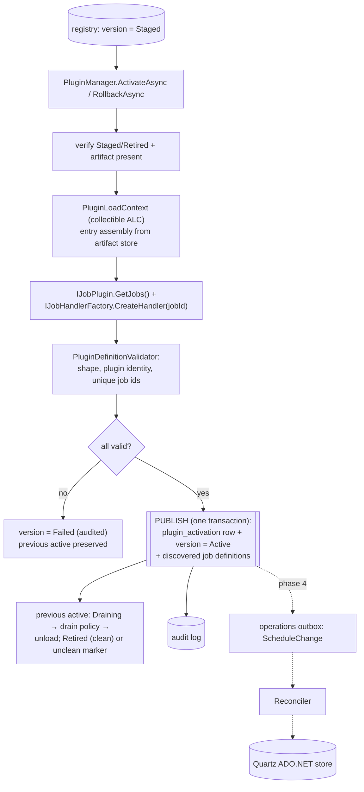
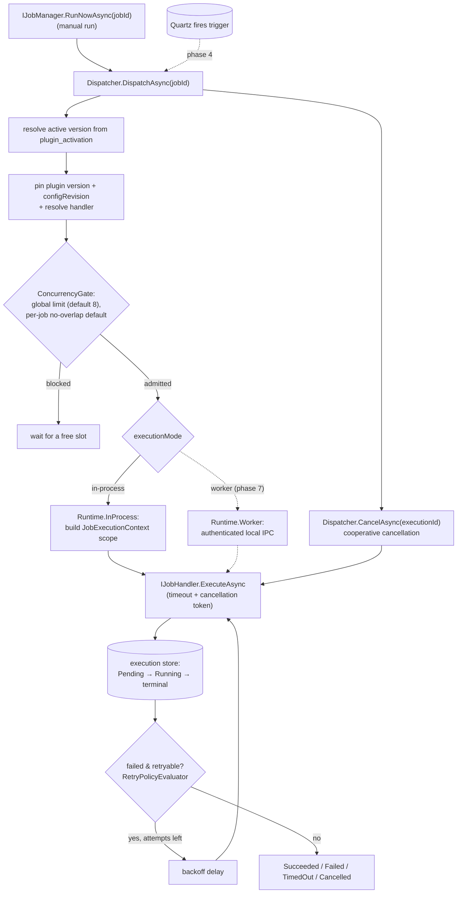
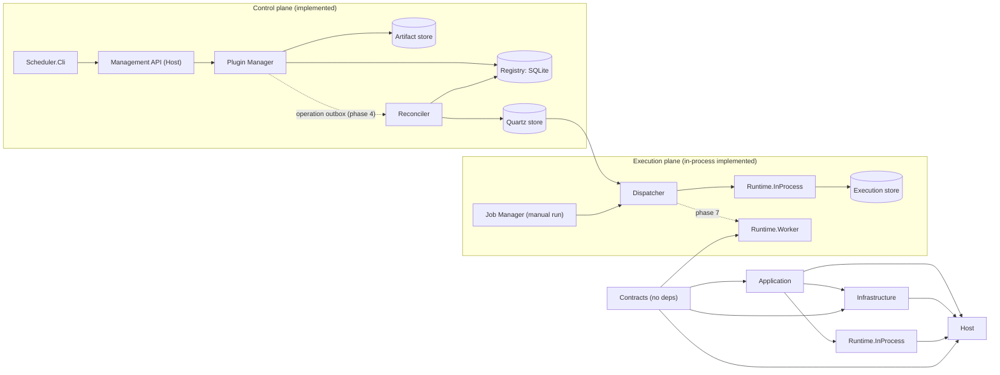

# Plugin Workflows

Diagrams for how plugins are loaded, stored, and executed. Sections and edges
marked **implemented** reflect the current code; anything dotted or labelled
with a later phase is **planned**. See
[11-implementation-plan.md](../11-implementation-plan.md),
[02-plugin-package.md](../02-plugin-package.md),
[03-plugin-lifecycle.md](../03-plugin-lifecycle.md), and
[05-scheduling-execution.md](../05-scheduling-execution.md).

## Install → validate → store (Phase 2 — implemented)

## Load & activate (Phase 3 — implemented)

`PluginLoadContext` loads the entry assembly from the retained artifact;
`IJobPlugin.GetJobs()` discovers definitions and `IJobHandlerFactory` resolves a
handler per job. Publication is one registry transaction: the single-row
`plugin_activation` write plus the version state and discovered job definitions.
Applying schedules to Quartz (the outbox → reconciler step) is phase 4.

## Execute (Phase 3 — implemented)

Manual runs enter through `IJobManager.RunNowAsync`; scheduled runs enter from
Quartz once phase 4 lands. The dispatcher resolves the active version, pins it
with the configuration revision, admits the execution under the concurrency
gates, and runs it to a terminal state. Retries loop inside the runner against
the already-pinned handler. Worker execution is phase 7.

## Modules & layering

Planned in later phases: the reconciler and Quartz trigger application (phase 4),
the management API/CLI lifecycle surface (phase 5), secrets/observability
(phase 6), and the worker backend (phase 7).
