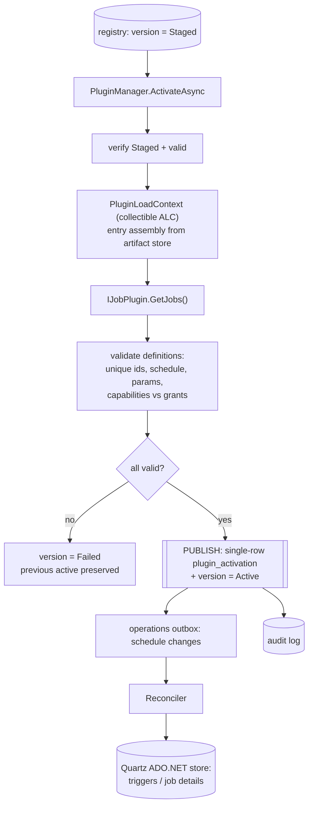
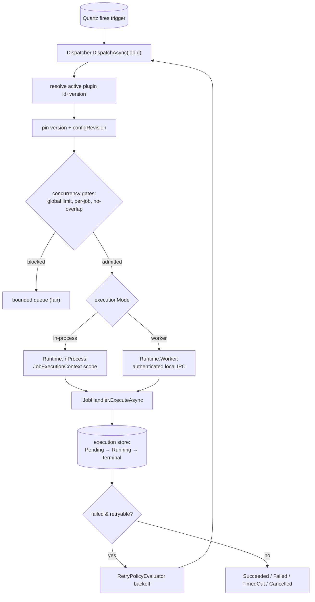
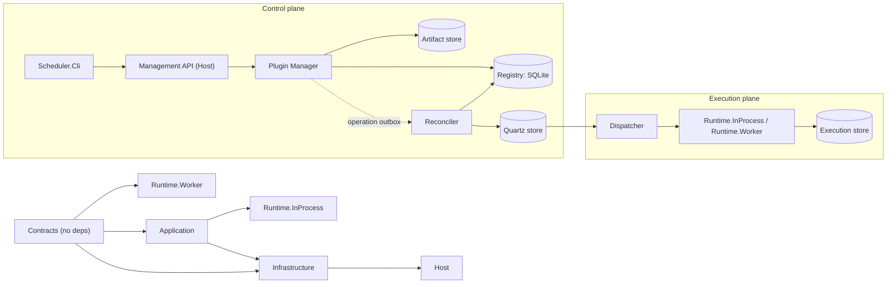

# Plugin Workflows

Diagrams for how plugins are loaded, stored, and executed. Sections marked
**implemented** reflect the current code; sections marked **planned** are the
Phase 3 targets the registry and artifact store already feed. See
[11-implementation-plan.md](../11-implementation-plan.md),
[02-plugin-package.md](../02-plugin-package.md),
[03-plugin-lifecycle.md](../03-plugin-lifecycle.md), and
[05-scheduling-execution.md](../05-scheduling-execution.md).

## Install → validate → store (Phase 2 — implemented)

## Load & activate (Phase 3 — planned)

`PluginLoadContext` exists as a skeleton today; the rest is the Phase 3 target.

## Execute (Phase 3 — planned)

## Modules & layering

