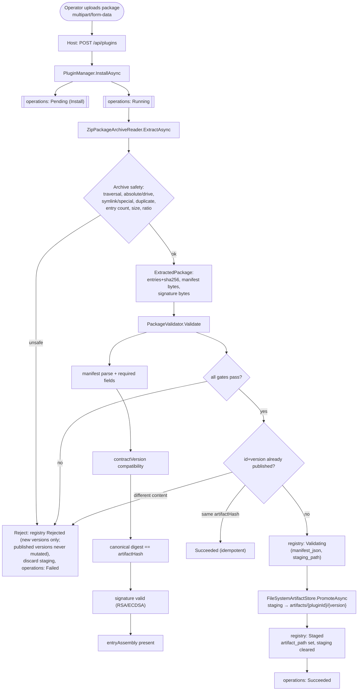
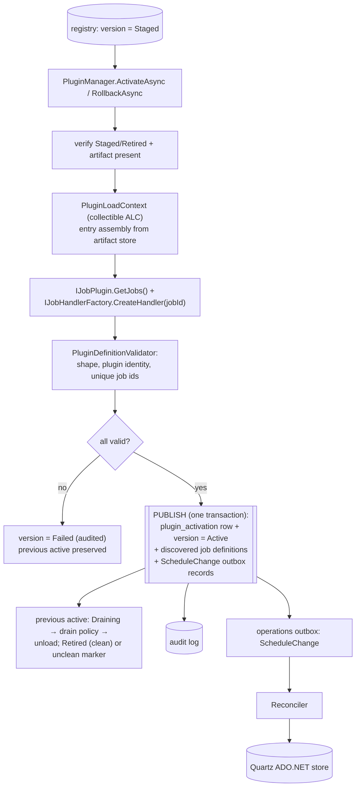
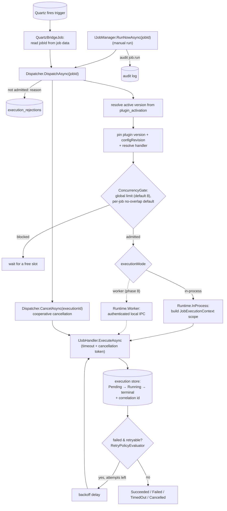
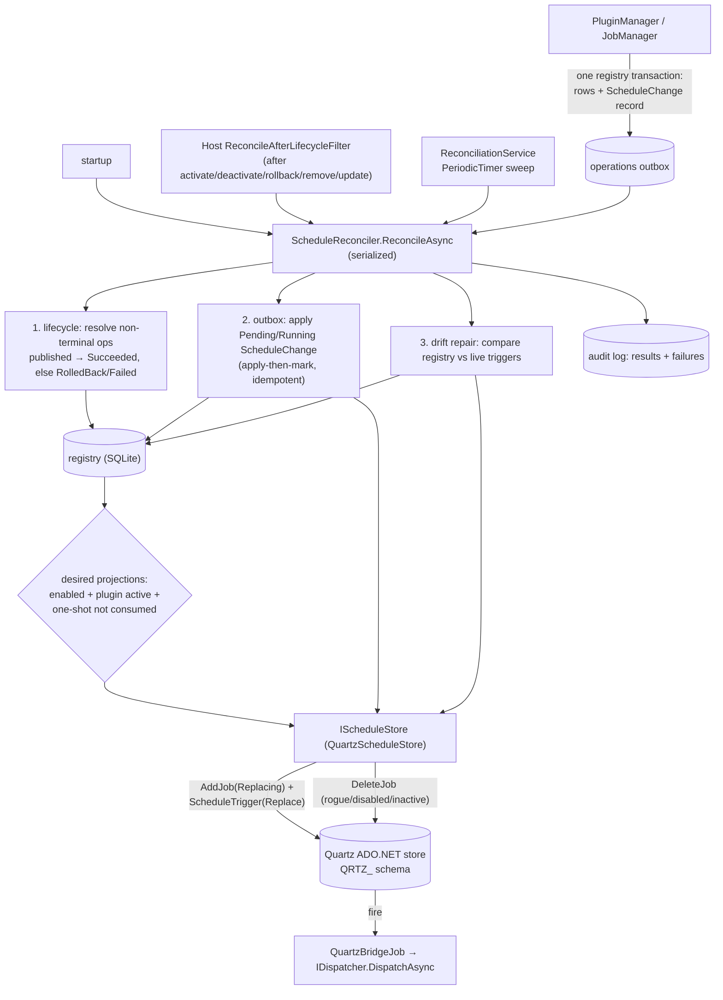
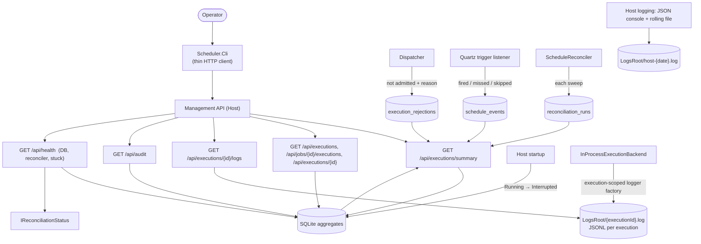
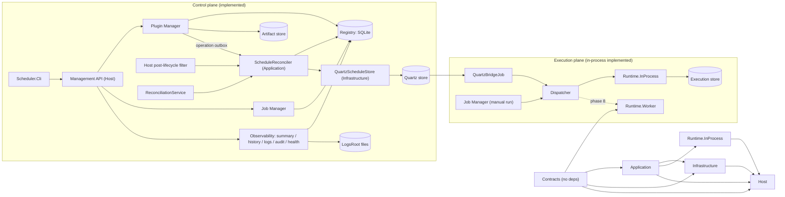

# Plugin Workflows

Diagrams for how plugins are loaded, stored, and executed. Sections and edges
marked **implemented** reflect the current code; anything dotted or labelled
with a later phase is **planned**. See
[11-implementation-plan.md](../11-implementation-plan.md),
[02-plugin-package.md](../02-plugin-package.md),
[03-plugin-lifecycle.md](../03-plugin-lifecycle.md), and
[05-scheduling-execution.md](../05-scheduling-execution.md).

## Install → validate → store (Phase 2 — implemented)

## Load & activate (Phase 3 — implemented)

`PluginLoadContext` loads the entry assembly from the retained artifact;
`IJobPlugin.GetJobs()` discovers definitions and `IJobHandlerFactory` resolves a
handler per job. Publication is one registry transaction: the single-row
`plugin_activation` write plus the version state and discovered job definitions.
The same transaction writes a `ScheduleChange` outbox record per job; the
reconciler applies them to Quartz (Phase 4).

## Execute (Phase 3–5 — implemented)

Manual runs enter through `IJobManager.RunNowAsync`; scheduled runs enter from
Quartz's bridge job. The dispatcher resolves the active version, pins it with
the configuration revision, admits the execution under the concurrency gates,
and runs it to a terminal state. A refused dispatch is recorded as a rejection,
and a manual run is audited. Retries loop inside the runner against the
already-pinned handler. Worker execution is phase 8.

## Reconcile & project to Quartz (Phase 4 — implemented)

The reconciler (`ScheduleReconciler`, in `Scheduler.Application`) is the only component that talks
to the scheduler, and it does so through the `IScheduleStore` port (`QuartzScheduleStore`, in
`Scheduler.Infrastructure`). It runs at startup, after each lifecycle/API mutation, and on the
periodic service; sweeps are serialized so they cannot race. Managers only publish durable outbox
records.

## Observe & operate (Phase 5 — implemented)

The operator surface is CLI-first: `Scheduler.Cli` is a thin HTTP client of the management API and
re-implements no logic. Every number is a durable SQL aggregate, so the done/not-done picture
survives restarts. Rejections, schedule fires/misses, and reconciliation runs are recorded durably
at the point they happen.

## Modules & layering

Quartz types stay inside `Scheduler.Infrastructure` (and the Host composition root); the reconciler
reaches Quartz only through the application-owned `IScheduleStore` port, so `Scheduler.Application`
and `Scheduler.Contracts` remain Quartz-free.

Planned in later phases: authenticated management-API surface and secret authorization (phase 6),
and the worker backend (phase 8).
